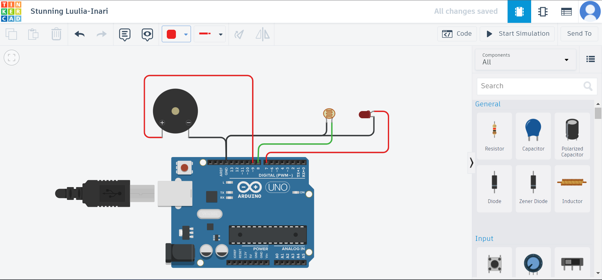

# LDR Sensor Security Alarm with Arduino

## Table Of Contents

1. [Introduction](#introduction)
2. [Project Overview](#project-overview)
3. [Components Required](#components-required)
4. [Circuit Diagram](#circuit-diagram)
5. [Arduino Sketch](#arduino-sketch)
   - [Source Code Explanation](#source-code-explanation)
6. [Conclusion](#conclusion)
7. [Future Enhancements](#future-enhancements)

## Introduction
The "LDR Sensor Security Alarm with Arduino" project combines the capabilities of Arduino, an LDR (Light Dependent Resistor), and a laser module to create a simple yet effective security alarm system. This project utilizes the interruption of a laser beam by an intruder to trigger an alarm, alerting you of potential unauthorized access.

## Project Overview
This project's main objective is to use the interruption of a laser beam detected by an LDR as a trigger to activate a security alarm. The LDR senses changes in light intensity caused by the interruption of the laser beam, and when triggered, an audible alarm is activated to alert you of a possible intrusion.

## Components Required
To create the LDR Sensor Security Alarm, you will need the following components:
- Arduino board (e.g., Arduino Uno)
- LDR (Light Dependent Resistor)
- Laser module
- Buzzer
- Jumper wires

## Circuit Diagram


## Arduino Sketch
```arduino
const int ldrPin = 8;       // Digital pin connected to LDR
const int buzzerPin = 9;    // Digital pin connected to the buzzer
const int laserPin = 7;     // Digital pin connected to the laser module
const int threshold = 500;  // Threshold value to trigger the alarm

void setup() {
  pinMode(buzzerPin, OUTPUT);
  pinMode(laserPin, OUTPUT);
  pinMode(ldrPin, INPUT);
  Serial.begin(9600);
}

void loop() {
  setupLaser();
  int ldrValue = digitalRead(ldrPin);
  Serial.println("LDR Value: " + String(ldrValue));

  if (ldrValue == HIGH) {  // LDR will be HIGH when laser is interrupted
    activateAlarm();
  } else {
    deactivateAlarm();
  }
  
  delay(1000); // Delay between readings
}

void activateAlarm() {
  digitalWrite(buzzerPin, HIGH);
  Serial.println("Intruder detected! Alarm activated.");
}

void deactivateAlarm() {
  digitalWrite(buzzerPin, LOW);
}

void setupLaser() {
  digitalWrite(laserPin, HIGH); // Turn on laser
}

void turnOffLaser() {
  digitalWrite(laserPin, LOW); // Turn off laser
}
```

### Source Code Explanation
The source code provided implements a simple security alarm system using an LDR and a laser module.

**1. `const int ...Pin = ...;`:**
These lines define the pin numbers for the LDR, buzzer, and laser module. Adjust these pin numbers based on your circuit connections.

**2. `void setup()`:**
In the `setup()` function, the pins are configured as inputs or outputs, and the serial communication is initialized for debugging.

**3. `void loop()`:**
In the `loop()` function, the laser is turned on using the `setupLaser()` function. The LDR value is read using `digitalRead(ldrPin)`, and if the LDR value is `HIGH` (indicating the laser is interrupted), the alarm is activated using the `activateAlarm()` function. Otherwise, the alarm is deactivated using the `deactivateAlarm()` function.

**4. `void activateAlarm()`:**
This function turns on the buzzer and sends a message to the serial monitor indicating that an intruder has been detected.

**5. `void deactivateAlarm()`:**
This function turns off the buzzer.

**6. `void setupLaser()`:**
This function turns on the laser module.

**7. `void turnOffLaser()`:**
This function can be used to turn off the laser module, but it's currently not utilized in the provided code.

## Conclusion
The LDR Sensor Security Alarm project demonstrates a basic method of using an LDR and a laser module to create a security alarm triggered by an interrupted laser beam. This concept can be extended and customized to create more sophisticated security systems with additional features.

## Future Enhancements
As you delve deeper into this project, consider incorporating other sensors, like motion sensors or cameras, to enhance the security system's accuracy and capabilities. You can also explore remote notifications via email or SMS to alert you when the alarm is triggered, enhancing the overall security functionality.

## Tags
Arduino, Security Alarm, LDR Sensor, Laser Module, Buzzer, Intrusion Detection, Electronics, DIY Project
